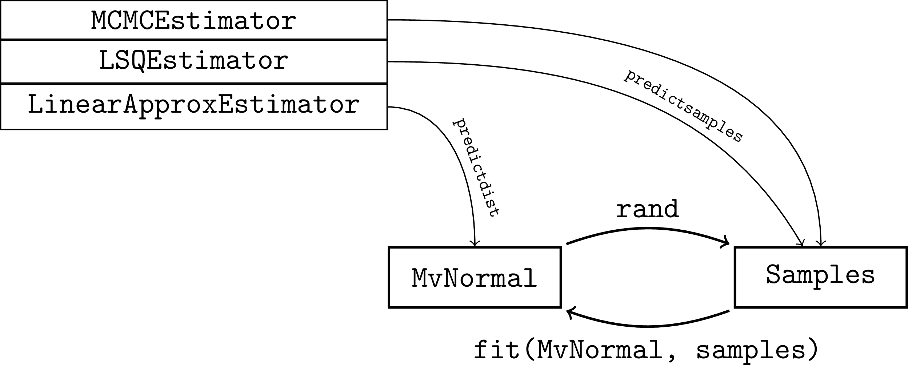

# ProbabilisticParameterEstimators.jl

[](https://github.com/JuliaCI/BenchmarkTools.jl/actions/workflows/CI.yml?query=branch%3Amaster)
[](https://codecov.io/gh/RomeoV/ProbabilisticParameterEstimators.jl)

Implementation of different parameter estimators that take in measures under uncertainty and produce a probability distribution over the parameters.

## High Level Example

``` julia
# observation function with multivariate observations
f(x, p) = [(x + 1)^2 - sum(p);
           (x + 1)^3 + diff(p)[1]]

# true parameter (to be estimated) and a prior belief
θtrue = [1.0, 2.0]
prior = MvNormal(zeros(2), 4.0 * I)

# observation noise
obsnoises = [rand()/10 * I(2) * MvNormal(zeros(2), I) for _ in eachindex(xs)]
noisemodel = UncorrGaussianNoiseModel(obsnoises)

# noisy observations x and y
xs = rand(5)
ysmeas = f.(xs, [θtrue]) .+ rand.(noises)

# find a probabilistic description of θ either as samples or as a distribution
# currently we provide three methods
for est in [MCMCEstimator(prior, f),
            LinearApproxEstimator(prior, f),
            LSQEstimator(prior, f)]
    # either
    samples =  predictsamples(est, xs, ysmeas, noisemodel, 100)
    # or
    dist    =  predictdist(est, xs, ysmeas, noisemodel; nsamples=100)
end
```

## Problem Setup
We assume parameters $\theta$ in $\mathbb{R}^m$, inputs $x$ in $\mathbb{R}^n$, and observations $y$ in $\mathbb{R}^l$, linked by a observation function $$y = f(x, \theta) + \varepsilon$$ where $\varepsilon$ is sampled from a known noise distribution $p_{\bar{\varepsilon}}$.
Further assumptions of the noise models are discussed below.
Notice also that $x$, $y$, and $theta$ may all be multidimensional, with different dimensions.

Given that we have uncertainty in the observations, we are interested in constructing a probabilistic description $p_{\bar{\theta}}(\theta \mid y)$ of the parameters $\theta$, either as a distribution, or as a set of samples.
We implement three estimators for this task, which map to either samples or a distribution via `predictsamples(est, xs, ys, noisemodel, nsamples)` and `predictdist(est, xs, ys, noisemodel)`, respectively.
The conversion between samples and a distribution can be done automatically via sampling or fitting a multivariate normal distribution.



### MCMCEstimator
The `MCMCEstimator` simply phrases the problem as a Monte-Carlo Markov-Chain inference problem, which we solve using the `NUTS` algorithm provided by `Turing.jl`.
Therefore `predictdist(::MCMCEstimator, xs, ys, nsamples)` will create `nsamples` samples (after skipping a number of warmup steps).
`predictdist(::MCMCEstimator, xs, ys, nsamples)` will do the same, and then fit a `MvNormal` distribution.

### LSQEstimator
The `LSQEstimator` works by sampling noise $\varepsilon^{(k)}$ from the noise model and repeatedly solving a least-squares parameter estimation problem for modified observations $y - \varepsilon^{(k)}$, i.e.
$$\theta = \arg \min_\theta \sum_i ((y_i - \varepsilon_i^{(k)}) - f(x_i, \theta))^2 \cdot w_i$$
for uncorrelated noise, where the weights $w_i$ are chosen as the inverse variance.
For correlated noise, the weight results from the whole covariance matrix.

Therefore `predictsamples(::LSQEstimator, xs, ys, nsamples)` will solve `nsamples` optimization problems and return a sample each.
`predictdist(::LSQEstimator, xs, ys, nsamples)` will do the same, and then fit a `MvNormal` distribution.

### LinearApproxEstimator
The `LinearApproxEstimator` solves the optimization problem above just once, and then constructs a multivariate normal distribution centered at the solution.
The covariance is constructed by computing the Jacobian of $f(x, \theta)$ and (roughly) multiplying it with the observation uncertainty.
See also [this wikipedia link](https://en.wikipedia.org/wiki/Non-linear_least_squares#Extension_by_weights).

Therefore `predictdist(::LinearApproxEstimator, xs, ys, nsamples)` will solve one optimization problem and compute one Jacobian, yielding a `MvNormal` and making it very efficient.
`predictsamples(::LinearApproxEstimator, xs, ys, nsamples)` will simply sample `nsample` times from this distribution, which is also very fast.


## Noise Models
We are currently considering three different possible noise models.
Consider again how we may have an observation $(x_i, y_i)$, and each $y_i$ may be multi-dimensional.
The first question is: Is noise correlated /across/ multiple observations $y_i$ and $y_j$, $i \neq j$?

If there is **no** correlation between observations, we can use the noise models:
- `UncorrGaussianNoiseModel`: A vector of (possibly multivariate) Gaussian noise distributions, one for each observation.
- `UncorrProductNoiseModel` : A vector of univariate noise distributions of any kind. Can not model correlations within a single observation.

If there **is** correlation between observations, we can provide a single multivariate Gaussian noise model.
 - `CorrGaussianNoiseModel`: A single multivariate normal distribution, with a noise component for each component in each observation. Multivariate observations are therefore flattened to correspond to the noise model.
