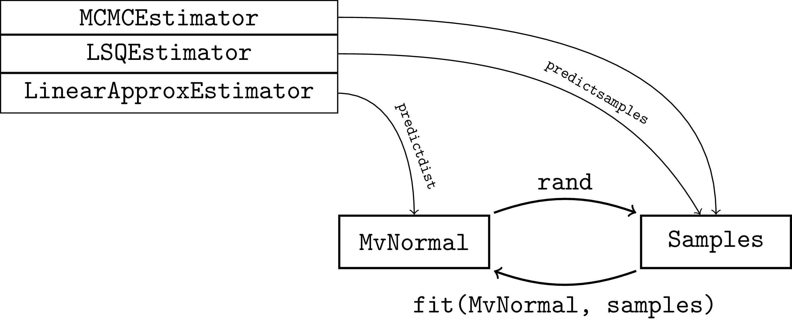

# Making Predictions And Estimation Methods

Given that we have uncertainty in the observations, we are interested in constructing a probabilistic description $p_{\bar{\theta}}(\theta \mid y)$ of the parameters $\theta$, either as a distribution, or as a set of samples.
We implement three estimators for this task, namely
- [`LSQEstimator`](@ref), 
- [`LinearApproxEstimator`](@ref), and
- [`MCMCEstimator`](@ref).
Each estimator constructs predictions either as samples or as a distribution; via [`predictsamples`](@ref) and [`predictdist`](@ref), respectively.
The conversion between samples and a distribution can be done automatically via sampling or fitting a multivariate normal distribution.



## Making Predictions
```@docs; canonical=true
ProbabilisticParameterEstimators.predictdist
ProbabilisticParameterEstimators.predictsamples
ProbabilisticParameterEstimators.EstimationMethod
```

## Estimation Methods
```@docs; canonical=true
LSQEstimator
LinearApproxEstimator
MCMCEstimator
```
